<!-- rmarkdown v1 -->
  
# Final Project
  
### Created by Asif Chowdhury, Justin Owens, Jash Choraria
  
This is the final project for CS 329E Elements of Data Visualizations with Dr. Philip Cannata. 
The data we will utilize comes Google Finance.
The topic is exploring the relationship between three major technology companies in the marketplace: Google, Apple and Microsoft from 2004 to present 2015.
The goals for this project are to demonstrate what we have learned using R and Tableau by analyzing this financial data and creating a reproducible set of interesting data visualizations.

In order to reproduce this project, please follow the following instructions.

## Step 1

#### Load the correct packages into R

Use the following code to load the correct packages into RStudio.
It might be necessary to install them manually if they have never been installed on your machince prior to this experience.
Be sure to read the message log to determine if it is necessary to do so because the in this file will not work without them.

```{r message = FALSE}
source("../01 Data/Packages.R", echo = TRUE)
```

## Step 2

#### Clean up the CSV files

Sometimes, the data in a CSV file is incompatible with Oracle. In this situation, we would want to clean up the data. 
Look at the code in "Reformatting Data.R" in the 01 Data folder, and modify the code as suggested in the comments, then run the code in order to get rid of special characters and set data types to those that are compatible with Oracle. 
You should now have a new CSV File with the reformatted data stored in the same folder as the original CSV file. Repeat this for all CSV files, modifying the file as needed.

If you do this for all three of our files ("Apple.csv", "MSFT.csv", "Google.csv"), you will also get the SQL code to create a table used in the next step.

## Step 3

#### Import Data to Oracle

We need to upload the cleaned CSV files into Oracle.

Begin by opening Oracle and initiating the connection to the database.
Open up an SQL Worksheet. Copy each of the SQL codes produced in Step2 into the worksheet. Change the Names of the tables to something more palatable than the default and run the script.

If done correctly, you should now have three new tables.

Import the data to the tables using the respective REFORMATTED CSV files. They should have been written to the same folder as the original CSV file. You should not get any errors if you completed the process correctly, making sure that the data is imported to the correct columns.

## Step 4

#### Modify dates in Oracle

Unfortunately, we ran into some problems with our data while working with it in Tableau and discovered that Step 2 does not actually format dates as Date type data for Oracle. Rather, it formats dates at VarChar2, which is not very compatible with Tableau. To work around this, we had to run a SQL statement to make a new column and format the old date using the TO_DATE function.

Run the following code in Oracle for EACH of the tables, replacing "APPLE" with the table name and "DATE_APPLE" with the correct column name: 

ALTER TABLE APPLE
ADD Y DATE;

UPDATE APPLE
SET Y = TO_DATE(DATE_APPLE, 'mm-dd-yyyy');

ALTER TABLE APPLE DROP COLUMN DATE_APPLE;

ALTER TABLE APPLE RENAME COLUMN Y TO DATE_APPLE;

This code changes dates from VarChar2 to Date type data which is necessary for easy use in Tableau.
We are finally finished cleaning up and importing the data for analysis.

## Step 5

#### Retrieve data via RStudio

We will work with the newly imported data first in RStudio.

Before creating any visualizations, it is necessary to retrieve the data.

Use the following script to retrieve the data for the Apple, Google, and Microsoft stocks from Oracle:

**For Apple:**
```{r message = FALSE}
source("../01 Data/GetAppleData.r", echo = TRUE)
```

**For Google:**
```{r message = FALSE}
source("../01 Data/GetGoogleData.r", echo = TRUE)
```

**For Microsoft:**
```{r message = FALSE}
source("../01 Data/GetMSFTData.r", echo = TRUE)
```

All of the data should now be imported.

If you look closely at the codes to retrieve the Apple and Microsoft data, you can see that we altered to embedded SQL statement to filter by dates. This is because Google went public after both Apple and Microsoft. For easy data blending, this filter was necessary to make each table have an equal amount of rows.

Next, we can use a bit of data-wrangling to combine the data frames for analysis.

## Step 6

#### Combine the data frames

In order to make the visualization for analysis, we need to combine the data frames and get only the columns we want.

Each of the date columns in each data frame is named differently, so we can standardize the columnn names to "DATE" for joining by using the following code:

```{r message = FALSE}
source("../02 Data Wrangling/ChangeColumnNames.r", echo = TRUE)
```

Now each of the data frames has a "DATE" column that we use for joining.

For a basic analysis (we will do more complicated analyses in Tableau in later steps), we want to join the data frames to get the adjusted closing price for stocks for each day. This new "DATE" column will come in handy for doing just that.

Use the following code to create a joined data frame, which we have named "CombinedDF":

```{r message = FALSE}
source("../02 Data Wrangling/CombineDF.r", echo = TRUE)
```

We now have a dataframe that we can use for visualizations of the data to compare the closing stock prices across time for Google, Apple and Microsoft.

## Step 7

#### Use Data Wrangling to Visualize the data in RStudio

With our newly created data frame, we thought it would be an excellent idea to simply plot the closing stock prices for each company on one graph. In order to do this, we need to use the melt function in the reshape2 package. This will help us create a single graph with multiple lines for each company.

The code to do so is the following:

```{r message = FALSE}
source("../02 Data Wrangling/LineOfAdj_Close.r", echo = TRUE)
```

From this line graph, we can see that the adjusted closing prices of Google vary a lot more than those of Apple and Microsoft and Google stocks seem to be worth quite a lot. As mentioned previously, the data progresses linearly through time from August 2004 to Early 2015, so we can observe the changes in the market over time. In addition, it seems that Apple and Microsoft have switched places in the market space with Apple currently having a high stock price than Microsoft. We can notice large spikes in the graph that we may be able to explain with further observation.

With this melted data frame, we can also create scatterplots to compare each company's adjusted closing prices.

Use the following code to reproduce these scatterplots with trendlines:

**Apple vs. Microsoft**
```{r message = FALSE}
source("../02 Data Wrangling/ScatterAM.r", echo = TRUE)
```

**Apple vs. Google**
```{r message = FALSE}
source("../02 Data Wrangling/ScatterAG.r", echo = TRUE)
```

**Google vs. Microsoft**
```{r message = FALSE}
source("../02 Data Wrangling/ScatterGM.r", echo = TRUE)
```

From these scatterplots, we can see that there is some sort of positive relationship between all of adjusted closing prices of the companies. There are definitely some patterns in the data, so it would probably be useful to transform the data for a more accurate and meaningful analysis (we will not be doing so for the purpose of this project). 

It seems that Apple and Microsoft have some sort of competition because in the first graph featuring the two companies, there seems to be a lot of variation around the trendlines moving back and forth. To the furthest right of the graph, there is a cluster of the highest Apple prices where the trend in Microsoft prices seems to be disconnect from the rest of the pattern.

In the second plot, there is also a cluster of higher Apple prices where it seems the Google price is not its highest. This could possibly suggest times where Apple appeared more dominant in the market than usual. We could possibly filter this data by time to see the dates of those clusters of data. You can almost see a swirling pattern in thise graph as well, also possibly suggesting some competition between Apple and Google.

The final scatterplot features Microsoft and Google. This graph seems to have the most linear pattern. At the furthest left of the graph, there seems to be a split in the data, rivaled by an exponential trend in the far right of the graph. We can see a cluster of most of the data around a value of 250 for Google and 25 for Microsoft.

Notice that we used a gradient scale to color the data based on Apple's ajusted closing price. This was to have a "base comparison" between all of the scatterplots.

In addition to the scatterplots, it might be useful to know the correlation coefficients and linear models for these comparisons. We can obtain these using the following code:

```{r message = FALSE}
source("../02 Data Wrangling/Correlations.r", echo = TRUE)
```

The correlation between **Apple** and Google: 0.8739
Slope: .2125

The correlation between **Apple** and Microsoft: 0.8491
Slope: 3.8218

The correlation between **Microsoft** and Google: 0.9137 
Slope: .0494

These correlations are all high, but it does not really prove to be too significant because there are patterns in the scatterplots.

## Step 8

#### Retrieve data via Oracle

Now that we have done some basic visualizations in RStudio, we can start doing some more complicated procedures in Tableau.
First we need to retrieve the data in Tableau.

1) Open Tableau.

2) Click Connect to "Oracle" underneath the Connect heading on the left side of the screen.

3) In the screen that appears, enter the required information:

For our project, you will need to replace "uteid" with "jdo589", "ac52722", "jc58247" for the Apple, Google and Microsoft datasets, respectively:
  


Once you have completed this three times, you should have correctly imported the three datasets to Tableau.

## Step 9

#### Create the relationships

Data blending is essentially combining data from multiple data sources, and this is exactly what we are doing for our analysis. We did not use the joining function in Tableau for this project.

For our data, we needed to create a relationship between the dates in each table.

Go to Data>Edit Relationships.
Make sure the primary data source is the Google source and the secondary source is the Apple source.
Click the add button and create the relation ship with "Date Google" and "Date Apple".
Repeat by changing the secondary data source to the Microsoft source and creating a relationship between "Date Google" and "Date Apple".

The relationships should look like this:


You should now be able to blend the data sources successfully for analysis.

## Step 10

#### Visualize the data in Tableau

The visualizations can be recreated by dragging the correct Dimensions and Measures to the proper places as decribed in the following pictures and completing all the steps outlined beneath each screenshot below while paying attention to any calculations we may have created.

Because there are at least 40 graphs in our final Tableau Workbook, we will explain how to create one graph per topic and note how to recreate the graphs for each company.


**Topic 1: Volatility**

The first section we will discuss is the idea of volatility of a particular company's stocks. Volitility is the idea of magnitude of fluctuation in the marketplace. Graphs with higher volatility are more undpredictable in a sense.

Recreate the following graph: 

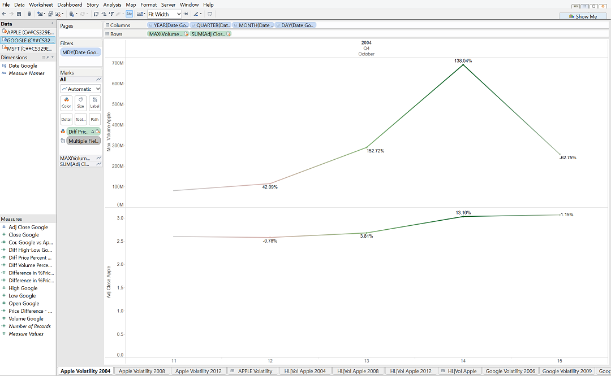

As you can see, this is a line graph of the volume and and ajusted closing price of the stocks for Apple on October 11-15 in 2004 a period of notable volume of trades.

In order to create this graph, we also created calculations of the following fashion-

(SUM([Adj Close Apple]) - Lookup(SUM([Adj Close Apple]), -1)) / Lookup(SUM([Adj Close Apple]), -1)

This finds the percentage change of the adjusted closing price from the previous day.

(SUM([Volume Apple]) - Lookup(SUM([Volume Apple]), -1)) / Lookup(SUM([Volume Apple]), -1)

This formula finds the percentage change of the volume from the previous day.

Through the graph, we notice a relationship in the the percentage change in volume traded and the percentage change of the adjusted closing prices.

For example: in this graph, the change in volume from Oct 13 to Oct 14 was quite drastic and it seems to be related to a drastic change in the adjusted closing price as well.
In addition to this graph, we have multiple graphs on this topic of volatility for each company for the years 2004, 2008 and 2012.

You can simply change the filter on the dates and modify the formulas for the companies specific adjusted closing and volume data values in order to recreate all of these graphs.

In a need for simplicity, we will only display condensed dashboards separated by company for all three years.

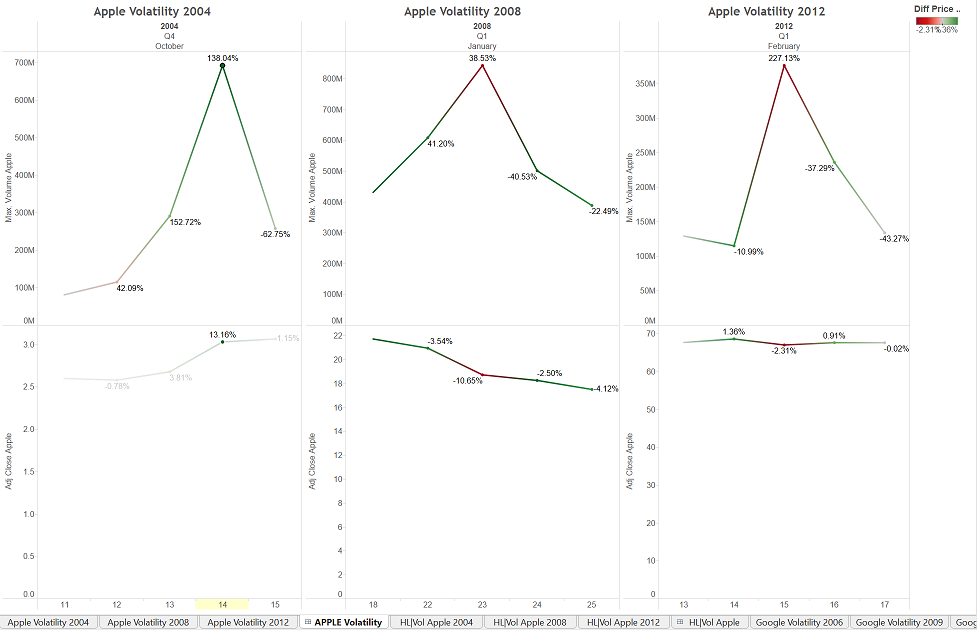


**Topic 2: Difference Between High and Low Prices**

The second topic discusses the difference between the high and low prices for particular months in relation to the volume changes and price changes.

Recreate the following graph:

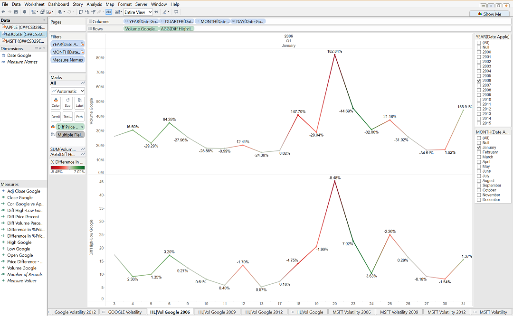

If you look at this line graph concerning Google, you will also notice a relationship between the Difference between the high and low prices for a day and the volume of the trading that day in October.

In order to recreate this graph, you will need to use the calculations from the volatility section. Luckily, they have already been made if you have followed this project in a linear progression.

Just as before, we will only show an example of this topic for one company and year, but you can recreate the other graphs by changing the filters and using the appropriate calculations that you created in the previous step. We will show the condensed version in a dashboard format below.

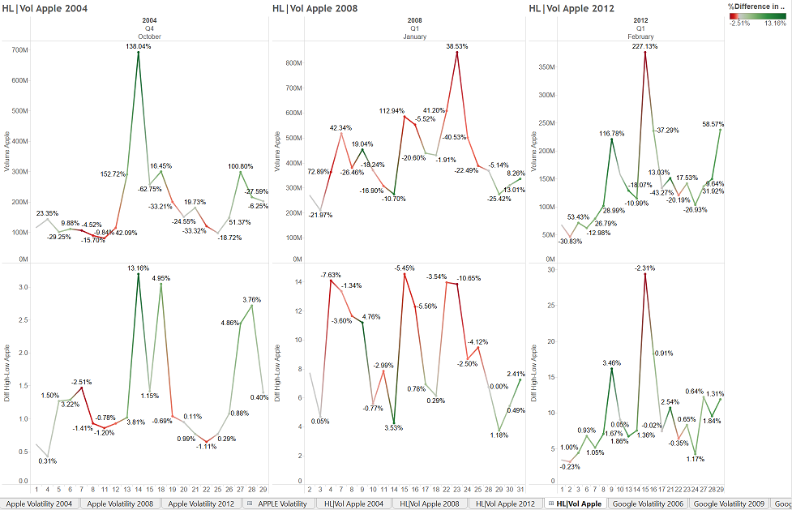

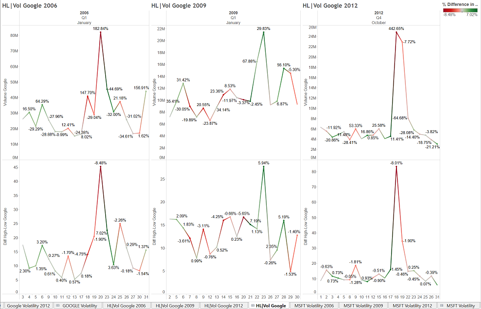

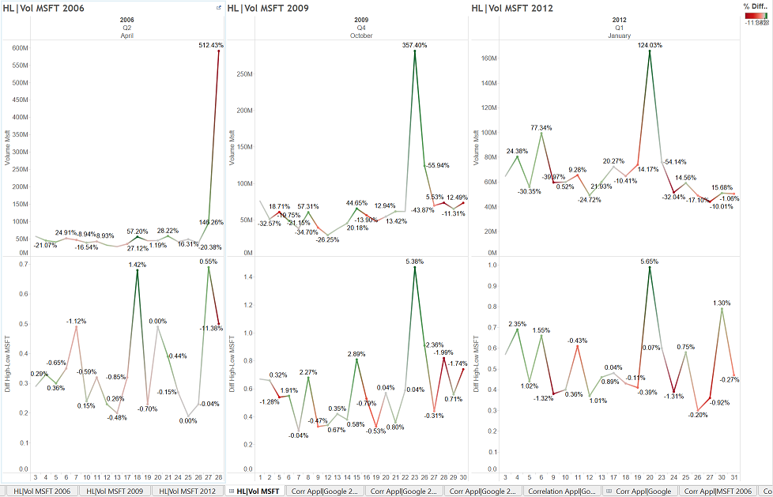


**Topic 3: Correlation**

The third topic centers around a relationship between the stock price changes for two companies across quarters and the difference in those differences.

Recreate the following graph:

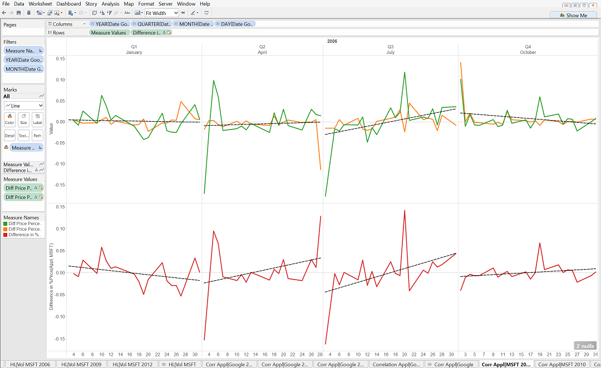

This graph shows let us visualize the movements in percent changes of stock price from the previous period and compare how that price change stack up against another company.

In order to recreate this graph, you will need to add one more calculation-

[Diff Price Percent Apple]+[MSFT (C##CS329E_JC52347)].[Diff Price Percent MSFT]

Once again, we will only provide one detailed example, but show the dashboard containing all the correlations between each company.

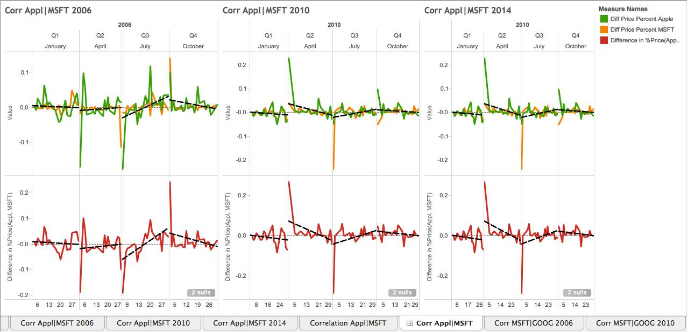

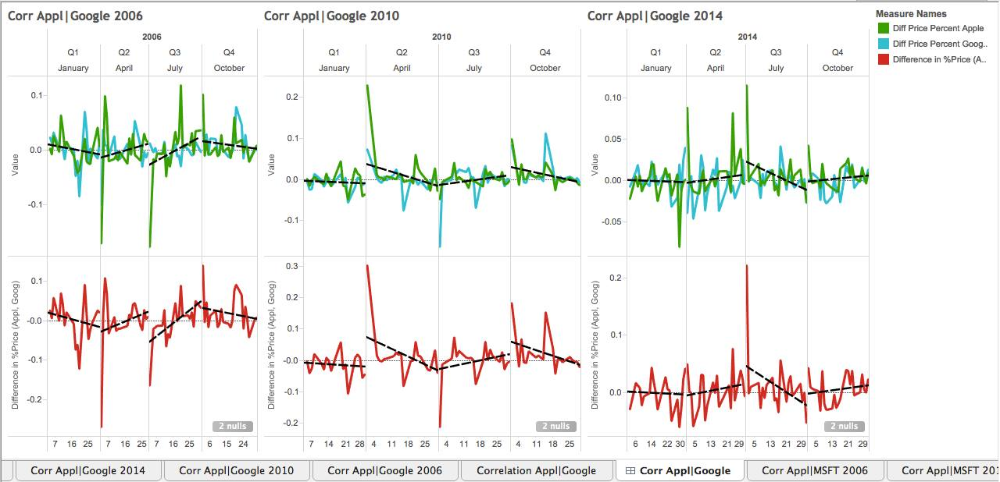

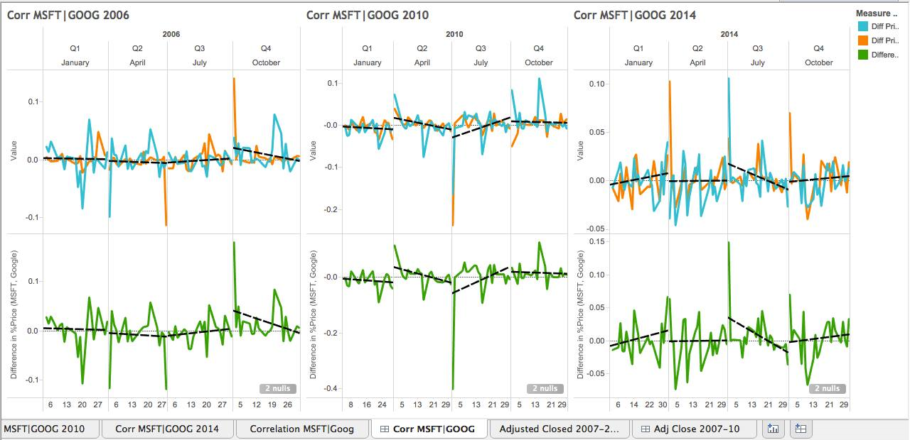


**Topic 4: Average Adjusted Price and Differences**

The fourth and final topic is the relationship between the average stock prices over a quarter and their changes from quarter to quarter. We will compare these observations across the companies.

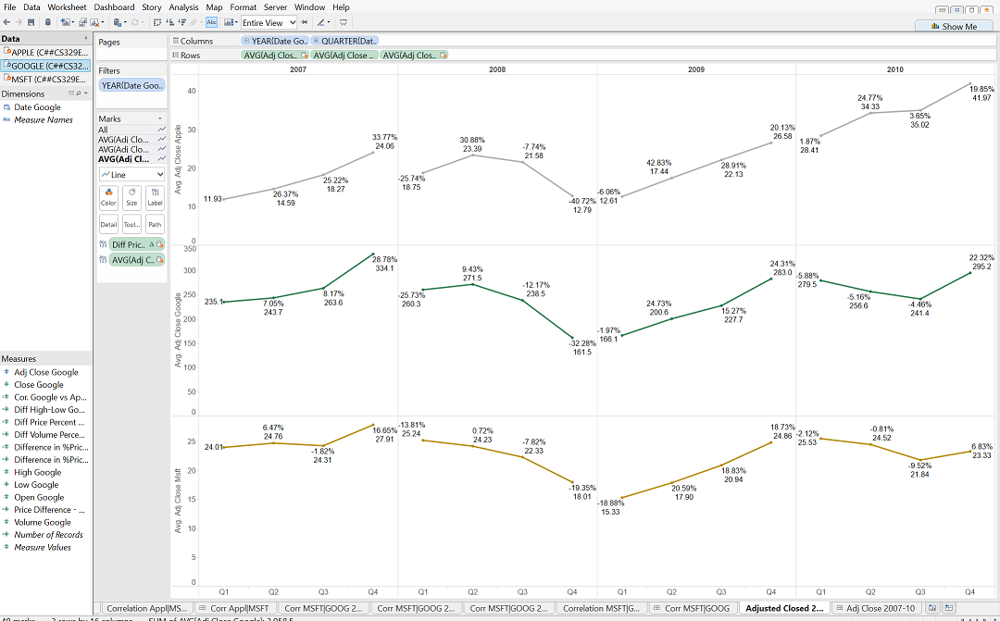

Be sure to use the AVERAGE adjusted closing price in your calculations by right clicking on the adjusted closing price pill and choosing Measure>Average.

This topic only contains this single graph, but this graph holds a lot of power in the fact that it can compare price changes during quarters so that we can easily visualize the potential effects of one company on another.

As you can see, each row of graphs shows the average adjusted closing price for each company along with the percentage change, and the columns separate the data by year and quarter.

You can see that as a whole over 2007, all companies experienced positive growth, but mid-2008, it is obvious that there was an effect on the market by the start of the financial crisis.

Fortunately, it seems that things started to turn around in the beginning of 2009 and continued to improve.

Notice that between 2009 and 2010, it seems as if Apple's average adjusted stock price continued to rise while Microsoft and Google's declined. This might be because the first iPad was released and became the first tablet to dominate the marketplace. 

