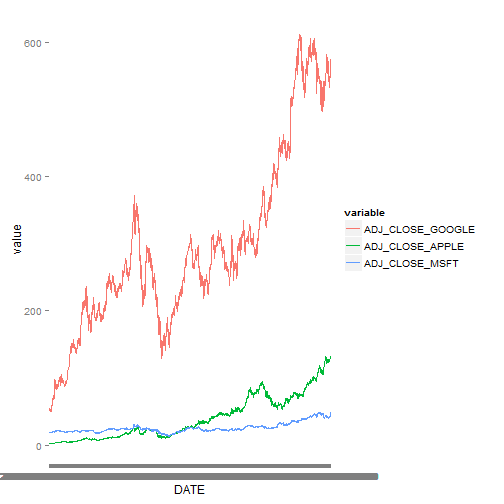

<!-- rmarkdown v1 -->
  
# Final Project
  
### Created by Asif Chowdhury, Justin Owens, Jash Choraria
  
This is the final project for CS 329E Elements of Data Visualizations with Dr. Philip Cannata. 
The data we will utilize comes Google Finance.
The topic is exploring the relationship between three major technology companies in the marketplace: Google, Apple and Microsoft.
The goals for this project are to demonstrate what we have learned using R and Tableau by analyzing this financial data and creating a reproducible set of interesting data visualizations.

In order to reproduce this project, please follow the following instructions.

## Step 1

#### Load the correct packages into R

Use the following code to load the correct packages into RStudio.
It might be necessary to install them manually if they have never been installed on your machince prior to this experience.
Be sure to read the message log to determine if it is necessary to do so.


```r
source("../00 Doc/Packages.R", echo = TRUE)
```

```
## 
## > require(plyr)
## 
## > require(dplyr)
## 
## > require(knitr)
## 
## > require(reshape2)
## 
## > require(RCurl)
## 
## > require(plyr)
## 
## > require(tidyr)
## 
## > require(jsonlite)
```

```
## Warning: package 'jsonlite' was built under R version 3.1.3
```

```
## 
## > require(lubridate)
```

```
## Warning: package 'lubridate' was built under R version 3.1.3
```

```
## 
## > require(ggplot2)
```

```
## Warning: package 'ggplot2' was built under R version 3.1.3
```

## Step 2

#### Clean up the CSV files

Sometimes, the data in a CSV file is incompatible with Oracle. In this situation, we would want to clean up the data. 
Look at the code in "Reformatting Data.R" in the 00 Doc folder, and modify the code as suggested in the comments, hen run the code in order to get rid of special characters and set data types to those that are compatible with Oracle. 
You should now have a new CSV File with the reformatted data. Repeat this for all CSV files, modifying the file as needed.

If you do this for all three of our files ("Apple.csv", "MSFT.csv", "Google.csv"), you will also get the SQL code to create a table used in the next step.

## Step 3

#### Import Data to Oracle

We need to upload the cleaned CSV files into Oracle.

Begin by opening oracle and initiating the connection to the database.
Open up an SQL Worksheet. Copy each of the SQL codes produced in Step2 into the worksheet. Change the Names of the tables to something more palatable than the default and run the script.
If done correctly, you should now have three new tables.

Import the data to the tables using the respective REFORMATTED CSV files. They should have been written to the same folder as the original CSV file. You should not get any errors if you completed the process correctly, making sure that the data is imported to the currenct columns.

## Step 4

#### Modify dates in Oracle

Unfortunately, we ran into some problems with our data while working with it in Tableau and discovered that Step 2 does not actually format dates as Date type data for Oracle. To work around this, we had to run a SQL statement to make a new column and format the old date using the TO_DATE function.

Run the following code in Oracle for EACH of the tables, replacing "APPLE" with the table name and "DATE_APPLE" with the correct column name: 

ALTER TABLE APPLE
ADD Y DATE;

UPDATE APPLE
SET Y = TO_DATE(DATE_APPLE, 'mm-dd-yyyy');

ALTER TABLE APPLE DROP COLUMN DATE_APPLE;
ALTER TALBE APPLE RENAME COLUMN Y TO DATE_APPLE;

This code changes dates from VarChar2 to Date type data which is necessary for easy use in Tableau.
We are finally finished cleaning up and importing the data for analysis.

## Step 5

#### Retrieve data via RStudio

We will work with the newly imported data first in RStudio.

Before creating any visualizations, it is necessary to retrieve the data.

Use the following script to retrieve the data for the Apple, Google, and Microsoft stocks from Oracle:

For Apple:

```r
source("../00 Doc/GetAppleData.r", echo = TRUE)
```

```
## 
## > Apple <- data.frame(fromJSON(getURL(URLencode("129.152.144.84:5001/rest/native/?query=\"select * from APPLE where date_apple >= \\'19-AUG-04\\'\""), .... [TRUNCATED] 
## 
## > head(Apple)
##   OPEN_APPLE HIGH_APPLE LOW_APPLE CLOSE_APPLE VOLUME_APPLE ADJ_CLOSE_APPLE
## 1     550.91     557.29    547.81    551.5100     94996300         76.8599
## 2     540.99     550.07    540.42    549.0700     82131700         76.5199
## 3     551.48     552.07    539.90    540.6700    106684900         75.3492
## 4     553.52     560.20    551.66    557.3601     97909700         77.6752
## 5     538.22     546.73    537.66    546.3900     83140400         76.1464
## 6     529.91     542.50    529.88    535.7300     94623200         74.6608
##            DATE_APPLE
## 1 2014-01-22 00:00:00
## 2 2014-01-21 00:00:00
## 3 2014-01-17 00:00:00
## 4 2014-01-15 00:00:00
## 5 2014-01-14 00:00:00
## 6 2014-01-13 00:00:00
```

For Google:

```r
source("../00 Doc/GetGoogleData.r", echo = TRUE)
```

```
## 
## > Google <- data.frame(fromJSON(getURL(URLencode("129.152.144.84:5001/rest/native/?query=\"select * from Google\""), 
## +     httpheader = c(DB = "jdbc: ..." ... [TRUNCATED] 
## 
## > head(Google)
##   OPEN_GOOGLE HIGH_GOOGLE LOW_GOOGLE CLOSE_GOOGLE VOLUME_GOOGLE
## 1      590.00      591.95     586.04       591.11       1501400
## 2      591.74      593.72     587.14       593.42       1160100
## 3      600.27      600.60     590.48       591.97       1571200
## 4      599.14      603.52     598.02       601.63       1599200
## 5      595.13      598.50     593.55       597.78       1799100
## 6      592.13      598.00     590.60       593.14       1630800
##   ADJ_CLOSE_GOOGLE         DATE_GOOGLE
## 1           591.11 2014-09-11 00:00:00
## 2           593.42 2014-09-10 00:00:00
## 3           591.97 2014-09-09 00:00:00
## 4           601.63 2014-09-08 00:00:00
## 5           597.78 2014-09-05 00:00:00
## 6           593.14 2014-09-04 00:00:00
```

For Microsoft:

```r
source("../00 Doc/GetMSFTData.r", echo = TRUE)
```

```
## 
## > MSFT <- data.frame(fromJSON(getURL(URLencode("129.152.144.84:5001/rest/native/?query=\"select * from MSFT where Date_MSFT >= \\'19-AUG-04\\'\""), 
## + .... [TRUNCATED] 
## 
## > head(MSFT)
##   OPEN_MSFT HIGH_MSFT LOW_MSFT CLOSE_MSFT VOLUME_MSFT ADJ_CLOSE_MSFT
## 1     38.61     38.90    38.02      38.11    37828600        36.8321
## 2     38.56     38.87    38.37      38.71    30286000        37.4120
## 3     38.42     38.55    37.99      38.36    36457300        37.0738
## 4     38.85     38.88    37.18      38.00   116305000        36.7258
## 5     38.21     38.98    38.12      38.94    51983600        37.6343
## 6     38.14     38.49    38.08      38.31    52109800        37.0254
##             DATE_MSFT
## 1 2013-12-10 00:00:00
## 2 2013-12-09 00:00:00
## 3 2013-12-06 00:00:00
## 4 2013-12-05 00:00:00
## 5 2013-12-04 00:00:00
## 6 2013-12-03 00:00:00
```

All of the data should now be imported.

If you look closely at the codes to retrieve the Apple and Microsoft data, you can see that we altered to embedded SQL statement to filter by dates. This is because Google went public after both Apple and Microsoft. For easy data blending, this filter was necessary to make each table have an equal amount of rows.

Next, we can use a bit of data-wrangling to combine the data frames for analysis.

## Step 6

#### Combine the data frames

In order to make the visualization for analysis, we need to combine the data frames and get only the columns we want.

Each of the date columns in each data frame is named differently, so we can standardize the columnn names to "DATE" for joining by using the following code:


```r
source("../00 Doc/ChangeColumnNames.r", echo = TRUE)
```

```
## 
## > names(Apple)[names(Apple) == "DATE_APPLE"] <- "DATE"
## 
## > names(MSFT)[names(MSFT) == "DATE_MSFT"] <- "DATE"
## 
## > names(Google)[names(Google) == "DATE_GOOGLE"] <- "DATE"
```

Now each of the data frames has a "DATE" column that we use for joining.

For a basic analysis (we will do more complicated analyses in Tableau in later steps), we want to join the data frames to get the adjusted closing price for stocks for each day. This new "DATE" column will come in handy for doing just that.

Use the following code to create a joined data frame, which we have named "CombinedDF":


```r
source("../00 Doc/CombineDF.r", echo = TRUE)
```

```
## 
## > CombinedDF <- Apple %>% inner_join(Google, by = "DATE") %>% 
## +     inner_join(MSFT, by = "DATE")
## 
## > head(CombinedDF)
##   OPEN_APPLE HIGH_APPLE LOW_APPLE CLOSE_APPLE VOLUME_APPLE ADJ_CLOSE_APPLE
## 1     550.91     557.29    547.81    551.5100     94996300         76.8599
## 2     540.99     550.07    540.42    549.0700     82131700         76.5199
## 3     551.48     552.07    539.90    540.6700    106684900         75.3492
## 4     553.52     560.20    551.66    557.3601     97909700         77.6752
## 5     538.22     546.73    537.66    546.3900     83140400         76.1464
## 6     529.91     542.50    529.88    535.7300     94623200         74.6608
##                  DATE OPEN_GOOGLE HIGH_GOOGLE LOW_GOOGLE CLOSE_GOOGLE
## 1 2014-01-22 00:00:00     1166.61     1167.89    1158.86      1165.02
## 2 2014-01-21 00:00:00     1160.93     1164.00    1151.30      1163.70
## 3 2014-01-17 00:00:00     1156.85     1160.63    1144.20      1150.53
## 4 2014-01-15 00:00:00     1152.99     1155.00    1143.79      1148.62
## 5 2014-01-14 00:00:00     1137.95     1151.00    1128.09      1149.40
## 6 2014-01-13 00:00:00     1126.47     1146.91    1117.17      1122.98
##   VOLUME_GOOGLE ADJ_CLOSE_GOOGLE OPEN_MSFT HIGH_MSFT LOW_MSFT CLOSE_MSFT
## 1       3139600         583.0931     36.26     36.32    35.75      35.93
## 2       3955800         582.4324     36.82     36.82    36.06      36.17
## 3       5397100         575.8408     36.83     36.83    36.15      36.38
## 4       3896400         574.8849     35.90     36.79    35.85      36.76
## 5       4960200         575.2753     34.73     35.88    34.63      35.78
## 6       4832900         562.0521     35.99     36.02    34.83      34.98
##   VOLUME_MSFT ADJ_CLOSE_MSFT
## 1    21904300        34.7252
## 2    31567300        34.9572
## 3    46267500        35.1602
## 4    44812600        35.5274
## 5    41623300        34.5803
## 6    45901900        33.8071
```

We now have a dataframe that we can use for visualizations of the data to compare the closing stock prices across time for Google, Apple and Microsoft.

## Step 7

#### Visualize the data in RStudio

With our newly created data frame, we thought it would be an excellent idea to simply plot the closing stock prices for each company on one graph. In order to do this, we need to use the melt function in the reshape2 package. This will help us create a single graph with multiple lines for each company.

The code to do so is the following:


```r
source("../00 Doc/LineOfAdj_Close.r", echo = TRUE)
```

```
## 
## > CombinedDFSub <- CombinedDF[c("DATE", "ADJ_CLOSE_GOOGLE", 
## +     "ADJ_CLOSE_APPLE", "ADJ_CLOSE_MSFT")]
## 
## > mdata <- melt(CombinedDFSub, id.vars = c("DATE"))
## 
## > p <- ggplot(mdata, aes(x = DATE, y = value, color = variable))
## 
## > p + geom_line(aes(group = variable))
```

 

**Insert observations here**

With this melted data frame, we can also create scatterplots to compare each company's adjusted closing prices.

Use the following code to reproduce these scatterplots with trendlines:

Apple vs. Microsoft

```r
source("../00 Doc/ScatterAM.r", echo = TRUE)
```

```
## 
## > CombinedDFSub <- CombinedDF[c("DATE", "ADJ_CLOSE_GOOGLE", 
## +     "ADJ_CLOSE_APPLE", "ADJ_CLOSE_MSFT")]
## 
## > head(CombinedDFSub)
##                  DATE ADJ_CLOSE_GOOGLE ADJ_CLOSE_APPLE ADJ_CLOSE_MSFT
## 1 2014-01-22 00:00:00         583.0931         76.8599        34.7252
## 2 2014-01-21 00:00:00         582.4324         76.5199        34.9572
## 3 2014-01-17 00:00:00         575.8408         75.3492        35.1602
## 4 2014-01-15 00:00:00         574.8849         77.6752        35.5274
## 5 2014-01-14 00:00:00         575.2753         76.1464        34.5803
## 6 2014-01-13 00:00:00         562.0521         74.6608        33.8071
## 
## > p3 <- ggplot(CombinedDFSub, aes(x = ADJ_CLOSE_APPLE, 
## +     y = ADJ_CLOSE_MSFT, color = ADJ_CLOSE_APPLE))
## 
## > p3 <- p3 + geom_point()
## 
## > p3 <- p3 + stat_smooth(method = glm)
## 
## > p3
```

 

Apple vs. Google

```r
source("../00 Doc/ScatterAG.r", echo = TRUE)
```

```
## 
## > CombinedDFSub <- CombinedDF[c("DATE", "ADJ_CLOSE_GOOGLE", 
## +     "ADJ_CLOSE_APPLE", "ADJ_CLOSE_MSFT")]
## 
## > p4 <- ggplot(CombinedDFSub, aes(x = ADJ_CLOSE_APPLE, 
## +     y = ADJ_CLOSE_GOOGLE, color = ADJ_CLOSE_APPLE))
## 
## > p4 <- p4 + geom_point()
## 
## > p4 <- p4 + stat_smooth(method = glm)
## 
## > p4
```

 

Google vs. Microsoft

```r
source("../00 Doc/ScatterGM.r", echo = TRUE)
```

```
## 
## > CombinedDFSub <- CombinedDF[c("DATE", "ADJ_CLOSE_GOOGLE", 
## +     "ADJ_CLOSE_APPLE", "ADJ_CLOSE_MSFT")]
## 
## > p5 <- ggplot(CombinedDFSub, aes(x = ADJ_CLOSE_GOOGLE, 
## +     y = ADJ_CLOSE_MSFT, color = ADJ_CLOSE_APPLE))
## 
## > p5 <- p5 + geom_point()
## 
## > p5 <- p5 + stat_smooth(method = glm)
## 
## > p5
```

 

In addition to the scatterplots, it might be useful to know the correlation coefficients and linear models for these comparisons.


```r
source("../00 Doc/Correlations.r", echo = TRUE)
```

```
## 
## > A_G_COR <- cor(CombinedDFSub$ADJ_CLOSE_APPLE, CombinedDFSub$ADJ_CLOSE_GOOGLE)
## 
## > print("Correlation between Apple and Google:")
## [1] "Correlation between Apple and Google:"
## 
## > A_G_COR
## [1] 0.8739328
## 
## > fitAG <- lm(CombinedDFSub$ADJ_CLOSE_APPLE ~ CombinedDFSub$ADJ_CLOSE_GOOGLE, 
## +     data = CombinedDFSub)
## 
## > summary(fitAG)
## 
## Call:
## lm(formula = CombinedDFSub$ADJ_CLOSE_APPLE ~ CombinedDFSub$ADJ_CLOSE_GOOGLE, 
##     data = CombinedDFSub)
## 
## Residuals:
##     Min      1Q  Median      3Q     Max 
## -34.814 -11.611  -3.079   8.127  43.140 
## 
## Coefficients:
##                                  Estimate Std. Error t value Pr(>|t|)    
## (Intercept)                    -22.454012   0.738423  -30.41   <2e-16 ***
## CombinedDFSub$ADJ_CLOSE_GOOGLE   0.212543   0.002279   93.26   <2e-16 ***
## ---
## Signif. codes:  0 '***' 0.001 '**' 0.01 '*' 0.05 '.' 0.1 ' ' 1
## 
## Residual standard error: 15.82 on 2690 degrees of freedom
## Multiple R-squared:  0.7638,	Adjusted R-squared:  0.7637 
## F-statistic:  8697 on 1 and 2690 DF,  p-value: < 2.2e-16
## 
## 
## > A_M_COR <- cor(CombinedDFSub$ADJ_CLOSE_APPLE, CombinedDFSub$ADJ_CLOSE_MSFT)
## 
## > print("Correlation between Apple and Microsoft:")
## [1] "Correlation between Apple and Microsoft:"
## 
## > A_M_COR
## [1] 0.8490853
## 
## > fitAM <- lm(CombinedDFSub$ADJ_CLOSE_APPLE ~ CombinedDFSub$ADJ_CLOSE_MSFT, 
## +     data = CombinedDFSub)
## 
## > summary(fitAM)
## 
## Call:
## lm(formula = CombinedDFSub$ADJ_CLOSE_APPLE ~ CombinedDFSub$ADJ_CLOSE_MSFT, 
##     data = CombinedDFSub)
## 
## Residuals:
##     Min      1Q  Median      3Q     Max 
## -33.218 -13.932  -5.224  13.855  45.663 
## 
## Coefficients:
##                               Estimate Std. Error t value Pr(>|t|)    
## (Intercept)                  -59.42739    1.24089  -47.89   <2e-16 ***
## CombinedDFSub$ADJ_CLOSE_MSFT   3.82184    0.04584   83.36   <2e-16 ***
## ---
## Signif. codes:  0 '***' 0.001 '**' 0.01 '*' 0.05 '.' 0.1 ' ' 1
## 
## Residual standard error: 17.2 on 2690 degrees of freedom
## Multiple R-squared:  0.7209,	Adjusted R-squared:  0.7208 
## F-statistic:  6950 on 1 and 2690 DF,  p-value: < 2.2e-16
## 
## 
## > M_G_COR <- cor(CombinedDFSub$ADJ_CLOSE_MSFT, CombinedDFSub$ADJ_CLOSE_GOOGLE)
## 
## > print("Correlation between Microsoft and Google:")
## [1] "Correlation between Microsoft and Google:"
## 
## > M_G_COR
## [1] 0.9137265
## 
## > fitMG <- lm(CombinedDFSub$ADJ_CLOSE_MSFT ~ CombinedDFSub$ADJ_CLOSE_GOOGLE, 
## +     data = CombinedDFSub)
## 
## > summary(fitMG)
## 
## Call:
## lm(formula = CombinedDFSub$ADJ_CLOSE_MSFT ~ CombinedDFSub$ADJ_CLOSE_GOOGLE, 
##     data = CombinedDFSub)
## 
## Residuals:
##    Min     1Q Median     3Q    Max 
## -6.077 -2.019 -0.247  1.445 10.711 
## 
## Coefficients:
##                                 Estimate Std. Error t value Pr(>|t|)    
## (Intercept)                    1.152e+01  1.371e-01   83.97   <2e-16 ***
## CombinedDFSub$ADJ_CLOSE_GOOGLE 4.937e-02  4.233e-04  116.63   <2e-16 ***
## ---
## Signif. codes:  0 '***' 0.001 '**' 0.01 '*' 0.05 '.' 0.1 ' ' 1
## 
## Residual standard error: 2.939 on 2690 degrees of freedom
## Multiple R-squared:  0.8349,	Adjusted R-squared:  0.8348 
## F-statistic: 1.36e+04 on 1 and 2690 DF,  p-value: < 2.2e-16
```

**Insert observations here**

## Step 8

#### Retrieve data via Oracle

Now that we have done some basic visualizations in RStudio, we can start doing some more complicated procedures in Tableau.
First we need to retrieve the data in Tableau.

1) Open Tableau.

2) Click Connect to "Oracle" underneath the Connect heading on the left side of the screen.

3) In the screen that appears, enter the required information:

For our project, you will need to replace "uteid" with "jdo589", "ac52722", "jc58247" for the Apple, Google and Microsoft datasets, respectively:
  


Once you have completed this three times, you should have correctly imported the three datasets to Tableau.

## Step 9

#### Create the relationships

Data blending is essentially combining data from multiple data sources, and this is exactly what we are doing for our analysis. We did not use the joining function in Tableau because our datasets are not stored in the same location.

For our data, we needed to create a relationship between the dates in each table.

Go to Data>Edit Relationships.
Make sure the primary data source is the Google source and the secondary source is the Apple source.
Click the add button and create the relation ship with "Date Google" and "Date Apple".
Repeat by changing the secondary data source to the Microsoft source and creating a relationship between "Date Google" and "Date Apple".

The relationships should look like this:


You should now be able to blend the data sources successfully for analysis.

## Step 10

#### Visualize the data in Tableau

The visualizations can be recreated by dragging the correct Dimensions and Measures to the proper places as decribed in the following pictures and completing all the steps outlined beneath each screenshot below.

For each visual, be sure to click on the new sheet button so that you can save each of your visualizations.

Also pay attention to any calculations that we have created.
